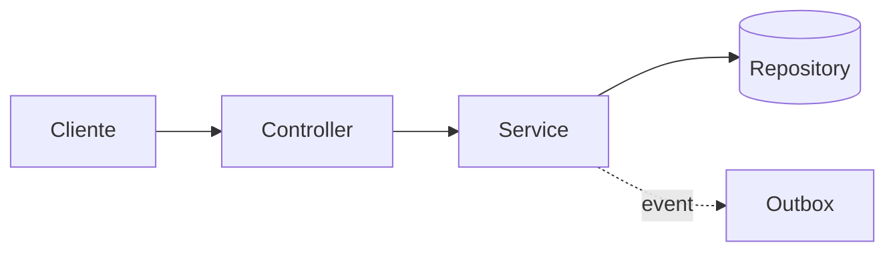

# Template — Architecture Decision Record (ADR)

🪶 LIDO SOB DEMANDA por Sergio (architect). Formato obrigatório de saída.

Toda entrega de Sergio é um ADR no formato abaixo, gravado em
`.claude/context/adr/ADR-NNN-<slug>.md` (cria a pasta se não existir). Iris linka
o ADR no índice de `architecture.md` no fechamento da TASK (NÃO em `decisions.md`
— esse é só para decisões informais abaixo do nível de ADR).

> Para iniciar um ADR concreto, há um scaffold copiável em
> `.claude/context/adr/ADR-000-template.md` (versão enxuta com dicas em comentário).
> O formato completo e autoritativo é o deste arquivo.

```markdown
# ADR-NNN: <título curto da decisão>
Data: YYYY-MM-DD
Status: proposto | aceito | substituído por ADR-MMM | revogado
Autor: Sergio (architect)
Contexto da TASK: TASK-XXX (se aplicável)

## Contexto
<2-5 parágrafos: qual o problema, qual a restrição, qual a escala atual e a
esperada, o que mudou pra essa decisão ser necessária agora. Inclua o
"por que agora?" — decisão prematura é tão ruim quanto decisão tardia.>

## Forças em jogo
- <restrição técnica 1 — ex: latência p95 abaixo de 300ms>
- <restrição de negócio — ex: time de 1 pessoa, prazo 4 semanas>
- <restrição organizacional — ex: ninguém no time conhece Kafka>
- <qualidade prioritária — ex: simplicidade > extensibilidade nesta fase>

## Alternativas consideradas

### Alternativa A — <nome>
- **Como funciona**: <descrição curta>
- **Prós**: <bullets>
- **Contras**: <bullets>
- **Custo de reverter**: baixo | médio | alto
- **Verdict**: <descartada por X | mantida na shortlist | escolhida>

### Alternativa B — <nome>
... (mesmo formato)

### Alternativa C — <nome>
... (opcional, quando houver terceira opção real)

## Decisão
<1 parágrafo: qual alternativa foi escolhida e por quê. Direto, sem hedge.>

## Consequências

### Positivas
- <bullets — o que essa decisão habilita>

### Negativas / Trade-offs aceitos
- <bullets — o que essa decisão custa, fecha ou complica>

### Mitigações
- <bullets — como reduzir os custos negativos>

## Restrições arquiteturais resultantes
<regras que valem daqui pra frente; Petra e Lucas vão respeitar>
- <ex: "todo acesso a Transaction passa pelo TransactionService — repositório é privado do módulo">
- <ex: "events de domínio publicados via outbox table, nunca direto no broker">

## Impacto nos agentes
- **Petra**: <como Petra deve quebrar em tasks com base nesta decisão>
- **Lucas**: <orientações de implementação — pacotes, padrão a usar>
- **Renata** (se aplicável): <impacto no contrato com o frontend>
- **Diana** (se aplicável): <delimitação clara entre arquitetura interna e contrato externo>
- **Otávio**: <pontos sensíveis para o review desta área daqui pra frente>
- **Sofia**: <que tipo de teste essa decisão exige — unit, integration, contract>

## Revisão futura
<gatilho que faria essa decisão ser revisitada — ex: "se latência p95 passar
de 500ms" ou "quando time crescer para 5+ devs">

## Referências
- <link a documentação interna, papers, padrões — se relevante>
```

## Diagramas — quando e como

Sergio inclui diagrama Mermaid no ADR **somente quando** o texto não comunica:
- Fluxo entre múltiplos componentes (5+ peças)
- Bounded contexts e suas relações
- Sequência temporal não-óbvia

Padrão: Mermaid em fenced block. Nunca PlantUML, nunca imagem binária no repo.



Se o diagrama precisar de mais de 30 linhas Mermaid, **divida em dois ADRs** —
provavelmente são duas decisões disfarçadas de uma.
